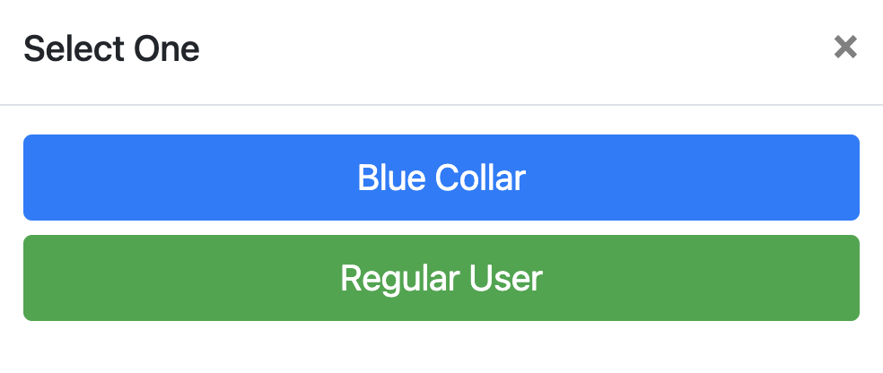

# Blue Collar

https://raketraket.herokuapp.com

## Stack
 &nbsp;
 &nbsp;
 &nbsp;
 &nbsp;
 &nbsp;
 &nbsp;
 &nbsp;
<a href ='https://jquery.com/'>   
 &nbsp;
 &nbsp;
 &nbsp;
 &nbsp;

## API's Used 

- [Mailbox Layer](https://mailboxlayer.com/)
- [MailJet](https://www.mailjet.com/)
- [AWS S3](https://aws.amazon.com)

## About

Back when I was in the Philippines, I was trying to rennovate our house. 

Then I have encountered a huge problem, I do not know any carpenter at all. 

My first instinct was to look over the internet, I searched on Google and looked into Yelp, but I could not find anything. Then one of my friend told me, try facebook, and indeed, I was able to find some on facebook. But, the challenging part was, I have to scroll all the way down to even find one if you are lucky. A post form someone can easily be drowned by the newest or latest postings, it was a complete waste of time. Furthermore, they do not have any ratings or comments, there is no way I can confirm if they are good or not. So I went on and asking my neighbor's if they know any carpenter, and someone pointed me to someone who knows someone that is a carpenter. 

To make the story short, it took me over a week to be able to find a carpenter near me and I do not have any idea if he is actually good or not and even if the fee he is asking is worth it or well within the market.

I thought to myself, if there is a website like airbnb that creates an ecosystem for units for rent, then there is no reason why I cannot create an ecosystem for bluecollar workers.

This project intends to solve the problem that I encountered and create an environment where bluecollar workers and potential clients meet together in one platform. That a good job is actually rated good, so as the bad ones. That it helps bluecollar workers create a free marketing for their skills set and provide a venue for them to guage their performance. That potential clients can easily find bluecollar workers near their area and can see if their portfolio.

> NOTE:
> - For now, I have only included the following bluecollar jobs: Carpenter, Painter, Electrician and Plumber
> - Currently this project only covers my hometown, ***PROVINCE OF CEBU***, as my test City.
> - I will be adding more bluecollar jobs and increase the scope to Entire Philippines in the near future.

## User Flow

You do not need to be registered to browse the current bluecollar workers available, but you need to be registered to be able to send message, make comment or ratings.

During registration, you will be asked if you are a Bluecollar or an Ordinary User

